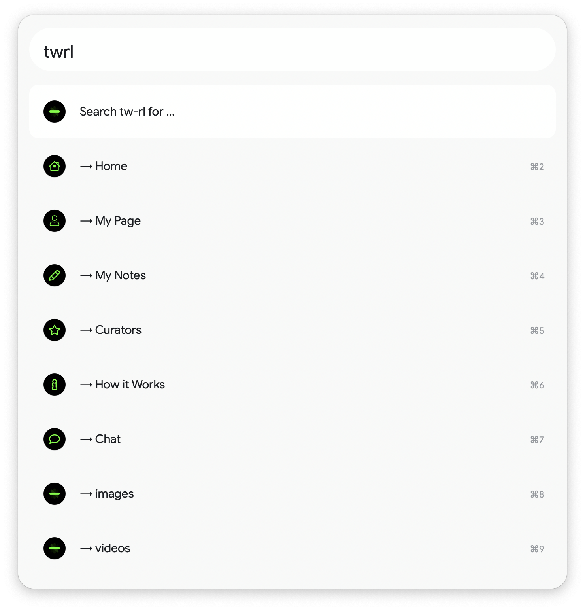

# Alfred Toolkit for tw-rl

Quickly access [tw-rl](https://tw-rl.com/)'s features, including adding links, viewing your profile, seeing your notes and more with the `twrl` keyword.

# Installation

1. Download the [latest release here](https://github.com/chrismessina/alfred-twrl-toolkit/releases/latest).
2. Double-click the `.alfredworkflow` to install it.

_You will need to purchase the [Alfred Powerpack](https://www.alfredapp.com/powerpack/) to enable this workflow._

# Changelog[¹](https://keepachangelog.com/)

## [v0.1.1] - 2021-04-29
### Added
- Go to user on tw-rl with `@` keyword

## [v0.1.0] - 2021-04-29
- Initial Release

# About

This workflow is unaffiliated with nor endorsed by tw-rl, Inc.

You can [file bugs](https://github.com/chrismessina/alfred-twrl-toolkit/issues/new) or [submit feature requests](https://github.com/chrismessina/alfred-twrl-toolkit/issues/new) on GitHub using the label `workflow:twrl-toolkit`.
